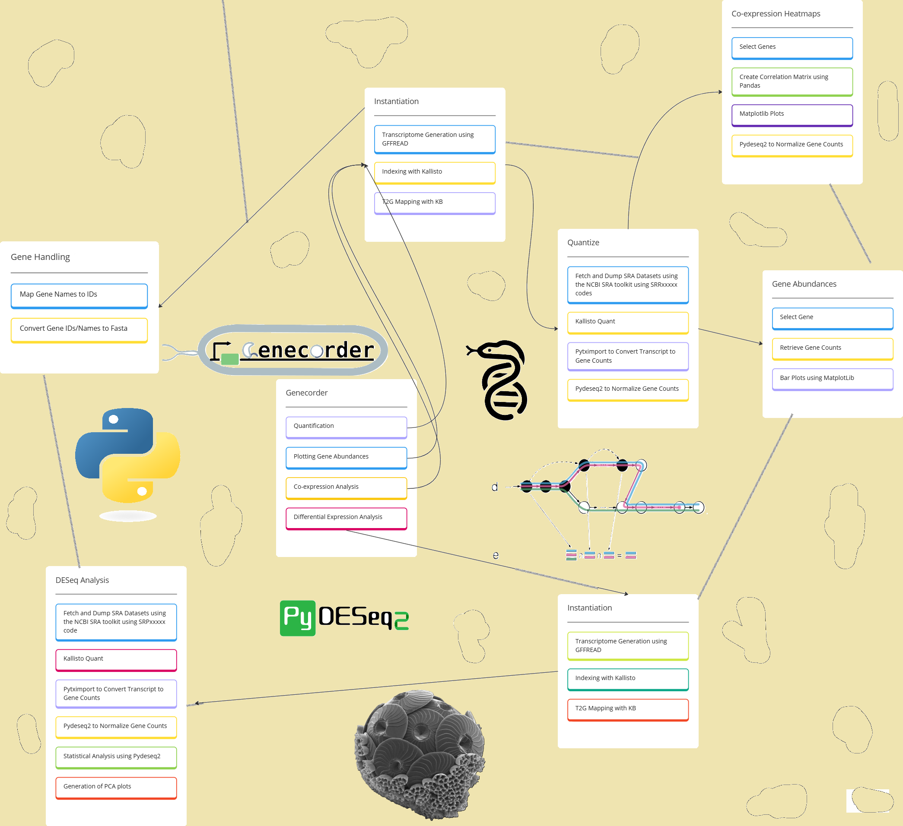

# GENECorder


## Workflow Diagram




## Table of Contents

- [Overview](#overview)
- [Key Features](#key-features)
- [Integrated Software Tools](#integrated-software-tools)
- [System Requirements](#system-requirements)
- [Installation](#installation)
- [Usage](#usage)
- [Commands and Getting Started](#commands-and-getting-started)
  - [1. `instantiate`](#1-instantiate)
  - [2. `quantize`](#2-quantize)
  - [3. `listquants`](#3-listquants)
  - [4. `plotga`](#4-plotga)
  - [5. `corr`](#5-corr)
  - [6. `name2id`](#6-name2id)
  - [7. `gene2fasta`](#7-gene2fasta)
  - [8. `listobjs`](#8-listobjs)
  - [9. `deseq`](#9-deseq)
  - [10. `remove`](#10-remove)
- [Example Workflow](#example-workflow)
- [Additional Notes](#additional-notes)
- [Troubleshooting](#troubleshooting)
- [Support and Contributions](#support-and-contributions)
- [License](#license)

---

## Overview

The **GENECorder** is an open-source, easy-to-use tool designed to help researchers analyze RNA sequencing (RNA-seq) datasets, regardless of their programming or bioinformatics expertise. Built to support bulk RNA-seq data from organisms listed on Ensembl, the tool simplifies data processing, quantifies gene expression, and produces an easily interpretable output file (`gene_counts.csv`) for downstream analysis. It integrates multiple bioinformatics tools behind the scenes, offering a smooth and automated workflow.

---

## Key Features

- **Easy Integration with Public Data**: Automatically fetches transcriptomic SRA datasets from the NCBI SRA database, supporting single-ended and paired-ended bulk RNASeq SRA data.
- **Built on Proven Bioinformatics Tools**: Incorporates trusted bioinformatics software like `kallisto`, `kb-python`, and `pytximport` for high-quality results.
- **User-Friendly Command-Line Interface**: Simple commands provided for easy interaction without requiring programming knowledge.
- **Cross-Database Compatibility**: Can map gene indices from multiple databases, enabling analysis with custom genomes and annotations.
- **Visual and Statistical Insights**: Built-in functions for gene expression plots and co-expression analysis.

---

## Integrated Software Tools

| Tool            | Functionality                                        | Purpose in GENECorder                             | References                                             |
|-----------------|------------------------------------------------------|---------------------------------------------------|-------------------------------------------------------|
| **Kallisto**    | RNA-seq transcript quantification                    | Processes RNA-seq reads into transcript abundances | [Kallisto GitHub](https://github.com/pachterlab/kallisto) |
| **kb-python**   | RNA-seq preprocessing, including handling FASTQ files | Fetches, prepares, and processes RNA-seq data     | [kb-python GitHub](https://github.com/pachterlab/kb_python) |
| **Gffread**     | GTF/GFF3 file processing                             | Extracts and converts gene annotations            | [Gffread GitHub](https://github.com/gpertea/gffread) |
| **Biopython**   | Biological computation and sequence manipulation     | Provides utilities for biological data processing | [Biopython](https://biopython.org) |
| **Pydeseq2**    | Differential expression analysis using DESeq2        | Calculates gene expression differences            | [Pydeseq2 GitHub](https://github.com/owkin/PyDESeq2) |
| **PyTximport**  | Converts transcript abundances to gene-level counts  | Handles conversion of quantified transcripts      | [PyTximport Docs](https://pytximport.readthedocs.io/en/latest/start.html) |
| **PyRanges**    | Efficient operations on genomic intervals            | Handles genomic range operations efficiently      | [PyRanges GitHub](https://github.com/biocore-ntnu/pyranges) |

---

## System Requirements

- **Supported Platforms**: macOS and Linux.
- **Required Dependencies**:
  - **Anaconda**: For managing Python dependencies. Nothing else needed; we take care of the rest.
  - **Internet Access**: Needed to prefetch SRA files from NCBI.
  - **Disk Space**: Ensure sufficient space is available for storing downloaded genome files, which depends on the extent of your analyses. Given it is bioinformatics throughput, memory requirements may sometimes be over 100 GBs.

---

## Installation

1. **Download `install.sh` using `wget`**:

   ```bash
   wget https://raw.githubusercontent.com/yashjonjale/gene-corder/refs/heads/main/install.sh
   ```

2. **Ensure Anaconda is installed**:

   Download it from [here](https://www.anaconda.com/products/individual).

3. **Run the `install.sh` script**:

   ```bash
   bash install.sh
   ```

   This command will install all the necessary dependencies, set up the environment, and install the tool.

---

## Usage

The general usage pattern for GENECorder is:

```bash
genecorder <command> [options]
```

To see the help message and list of available commands:

```bash
genecorder --help
```
Ensure that you are working in same directory/folder while running commands to ensure smooth running of the tool.

---

## Commands and Getting Started

### 1. `instantiate`

**Description:** Instantiate an object for an organism. This sets up the necessary indices and mappings for downstream analyses.

**Usage:**

```bash
genecorder instantiate --organism <organism_name> --name <object_name> [--desc <description>] [--transcriptome_path <transcriptome.fasta>] --genome_path <genome.fasta> --gtf_path <annotation.gtf>
```

**Arguments:**

- `--organism`: **(Required)** Name of the organism (e.g., `Homo sapiens`).
- `--name`: **(Required)** A unique name for this object (used in future commands).
- `--desc`: **(Optional)** Description for this object.
- `--transcriptome_path`: **(Optional)** Path to transcriptome FASTA file. If not provided, it will be generated from the genome and GTF files.
- `--genome_path`: **(Required)** Path to genome FASTA file.
- `--gtf_path`: **(Required)** Path to annotation GTF/GFF file.

**Example:**

```bash
genecorder instantiate --organism "Homo sapiens" --name human_obj --genome_path /path/to/human_genome.fa --gtf_path /path/to/human_annotation.gtf
```

---

### 2. `quantize`

**Description:** Quantify RNA-Seq data using Kallisto for the specified object.

**Usage:**

```bash
genecorder quantize --sra <sra_accession_codes> --name <quantification_name> --obj <object_name> [--paired]
```

**Arguments:**

- `--sra`: **(Required)** Comma-separated list of SRA accession codes (e.g., `SRR1234567,SRR1234568`).
- `--name`: **(Required)** Name for this quantification.
- `--obj`: **(Required)** Name of the object created with `instantiate`.
- `--paired`: **(Optional)** Include if reads are paired-end.

**Example:**

```bash
genecorder quantize --sra SRR1234567,SRR1234568 --name quant1 --obj human_obj --paired
```

---

### 3. `listquants`

**Description:** List all quantifications associated with a specified object.

**Usage:**

```bash
genecorder listquants --obj <object_name>
```

**Arguments:**

- `--obj`: **(Required)** Name of the object.

**Example:**

```bash
genecorder listquants --obj human_obj
```

---

### 4. `plotga`

**Description:** Plot the abundances of a specified gene across samples in a quantification.

**Usage:**

```bash
genecorder plotga --gene <gene_name_or_id> [--named] --obj <object_name> --quantification_name <quantification_name> --output <output_file>
```

**Arguments:**

- `--gene`: **(Required)** Gene name or ID to plot.
- `--named`: **(Optional)** Include if providing a gene name instead of an ID.
- `--obj`: **(Required)** Name of the object.
- `--quantification_name`: **(Required)** Name of the quantification.
- `--output`: **(Required)** Path to save the output plot (e.g., `abundance_plot.png`).

**Example:**

Plotting by gene name:

```bash
genecorder plotga --gene BRCA1 --named --obj human_obj --quantification_name quant1 --output brca1_abundance.png
```

Plotting by gene ID:

```bash
genecorder plotga --gene ENSG00000012048 --obj human_obj --quantification_name quant1 --output brca1_abundance.png
```

---

### 5. `corr`

**Description:** Generate a correlation matrix and heatmap for a list of genes based on their expression levels.

**Usage:**

```bash
genecorder corr --genes <gene_list_file> --obj <object_name> --quantification_name <quantification_name> --output_dir <output_directory>
```

**Arguments:**

- `--genes`: **(Required)** Path to a text file containing a list of gene IDs or names (one per line).
- `--obj`: **(Required)** Name of the object.
- `--quantification_name`: **(Required)** Name of the quantification.
- `--output_dir`: **(Required)** Directory to save the correlation matrix and heatmap.

**Example:**

```bash
genecorder corr --genes genes.txt --obj human_obj --quantification_name quant1 --output_dir ./correlation_results/
```

---

### 6. `name2id`

**Description:** Convert a gene name to its corresponding gene ID.

**Usage:**

```bash
genecorder name2id --gene_name <gene_name> --obj <object_name>
```

**Arguments:**

- `--gene_name`: **(Required)** The gene name to convert.
- `--obj`: **(Required)** Name of the object.

**Example:**

```bash
genecorder name2id --gene_name BRCA1 --obj human_obj
```

---

### 7. `gene2fasta`

**Description:** Extract the sequence of a gene and save it as a FASTA file.

**Usage:**

```bash
genecorder gene2fasta --gene <gene_name_or_id> --obj <object_name> --output_dir <output_directory> [--named]
```

**Arguments:**

- `--gene`: **(Required)** Gene name or ID to extract.
- `--obj`: **(Required)** Name of the object.
- `--output_dir`: **(Required)** Directory to save the FASTA file.
- `--named`: **(Optional)** Include if providing a gene name instead of an ID.

**Example:**

Extracting by gene name:

```bash
genecorder gene2fasta --gene BRCA1 --named --obj human_obj --output_dir ./gene_sequences/
```

Extracting by gene ID:

```bash
genecorder gene2fasta --gene ENSG00000012048 --obj human_obj --output_dir ./gene_sequences/
```

---

### 8. `listobjs`

**Description:** List all instantiated objects.

**Usage:**

```bash
genecorder listobjs
```

**Example:**

```bash
genecorder listobjs
```

---

### 9. `deseq`

**Description:** Perform differential expression analysis using DESeq2 on RNA-Seq data from specified SRA accession codes.

**Usage:**

```bash
genecorder deseq --obj <object_name> --quantification_name <analysis_name> --srp <sra_accession_codes> [--paired] --output_dir <output_directory>
```

**Arguments:**

- `--obj`: **(Required)** Name of the object.
- `--quantification_name`: **(Required)** Name for this analysis.
- `--srp`: **(Required)** Comma-separated SRA accession codes (e.g., `SRR1234567,SRR1234568`).
- `--paired`: **(Optional)** Include if reads are paired-end.
- `--output_dir`: **(Required)** Directory to save analysis results.

**Example:**

```bash
genecorder deseq --obj human_obj --quantification_name de_analysis1 --srp SRR1234567,SRR1234568 --paired --output_dir ./deseq_results/
```

---

### 10. `remove`

**Description:** Remove an instantiated object and its associated data.

**Usage:**

```bash
genecorder remove --obj <object_name>
```

**Arguments:**

- `--obj`: **(Required)** Name of the object to remove.

**Example:**

```bash
genecorder remove --obj human_obj
```

---

## Example Workflow

Below is an example of a typical workflow using GENECorder:

1. **Instantiate an Object for an Organism:**

   ```bash
   genecorder instantiate --organism "Homo sapiens" --name human_obj --genome_path /path/to/human_genome.fa --gtf_path /path/to/human_annotation.gtf
   ```

2. **Quantify RNA-Seq Data:**

   ```bash
   genecorder quantize --sra SRR1234567,SRR1234568 --name quant1 --obj human_obj --paired
   ```

3. **List Quantifications:**

   ```bash
   genecorder listquants --obj human_obj
   ```

4. **Plot Gene Abundances:**

   ```bash
   genecorder plotga --gene BRCA1 --named --obj human_obj --quantification_name quant1 --output brca1_abundance.png
   ```

5. **Generate Correlation Matrix:**

   ```bash
   genecorder corr --genes genes.txt --obj human_obj --quantification_name quant1 --output_dir ./correlation_results/
   ```

6. **Perform Differential Expression Analysis:**

   ```bash
   genecorder deseq --obj human_obj --quantification_name de_analysis1 --srp SRR1234567,SRR1234568 --paired --output_dir ./deseq_results/
   ```

7. **Extract Gene Sequence:**

   ```bash
   genecorder gene2fasta --gene BRCA1 --named --obj human_obj --output_dir ./gene_sequences/
   ```

8. **Remove an Object:**

   ```bash
   genecorder remove --obj human_obj
   ```

---

## Additional Notes

- Ensure that you have a stable internet connection when running commands that download data (e.g., `quantize`, `deseq`).
- All data and outputs are organized under the `data/` directory, structured by object and quantification names.
- The tool maintains a `config.json` file to track objects and their associated data. Do not modify this file manually.
- Use the `--paired` flag if your RNA-Seq data is from paired-end sequencing; otherwise, omit it for single-end data.
- For the `corr` command, the gene list file should contain one gene name or ID per line.
- The `deseq` command accepts SRA accession codes directly via the `--srp` argument.

---

## Troubleshooting

- **Config File Not Found:** Ensure you have run the `instantiate` command to create the initial configuration.
- **File Not Found Errors:** Verify that all file paths provided are correct and accessible.
- **Gene Not Found:** Ensure gene names or IDs are correct and present in the organism's annotation.
- **Internet Connection:** Some commands require downloading data from NCBI SRA; ensure you have internet access.
- **Command Not Recognized:** Double-check the command names as they might have changed (e.g., `list_quant` is now `listquants`).

---

## Support and Contributions

For issues, questions, or contributions, please refer to the project's GitHub repository or contact the maintainer.

---

*This documentation provides an overview of GENECorder's capabilities and usage. For detailed information, please consult the source code or reach out to the development team.*